# Semantic Search Engine

Embedding-based semantic search and movie recommendations using FAISS + Graph + RAG,
with production-grade serving via Gunicorn, Redis caching, and Milvus vector database.

**Stack:** Python · FAISS · Milvus · sentence-transformers · NetworkX · FastAPI · Redis · Ollama

---

## TODO
- [x] Embeddings + FAISS index
- [x] Graph layer (NetworkX)
- [x] RAG layer (Ollama)
- [x] FastAPI + precision@k evaluation
- [x] Production optimization, simulation + load testing

---

## Prerequisites

Before running the project, start these three services:

### 1. Ollama (local LLM for RAG explanations)
```bash
brew install ollama
brew services start ollama
ollama pull llama3.2
```

### 2. Redis (caching layer)
```bash
brew install redis
brew services start redis
redis-cli ping   # should return PONG
```

### 3. Milvus (vector database for streaming index)
```bash
# Download compose file (one time only)
curl -o milvus-compose.yml https://raw.githubusercontent.com/milvus-io/milvus/v2.4.0/deployments/docker/standalone/docker-compose.yml

# Start Milvus + etcd + MinIO
docker compose -f milvus-compose.yml up -d

# Verify all three containers are running
docker ps

# Stop when done
docker compose -f milvus-compose.yml down
```

---

## Setup

```bash
# Clone the repo
git clone https://github.com/PriscillaRoy/content-discovery-engine.git
cd content-discovery-engine

# Create virtual environment
python3.11 -m venv venv
source venv/bin/activate

# Install dependencies
pip install -r requirements.txt
```

---

## Build the indexes

Run these in order — each step depends on the previous:

```bash
python3 embeddings.py    # Step 1: embed descriptions + build FAISS index
python3 graph.py         # Step 2: build NetworkX graph
```

---

## Start the server

```bash
# Development (single worker, auto-reload)
./start.sh dev

# Local simulation (2 Gunicorn workers)
./start.sh local

# Production (full workers based on CPU count)
GUNICORN_WORKERS=25 ./start.sh local
```

---

## API Endpoints

| Method | Endpoint | Description |
|--------|----------|-------------|
| GET | `/health` | Health check |
| GET | `/similar/{title}` | FAISS similarity search |
| POST | `/recommend` | Combined FAISS + Graph recommendations |
| POST | `/explain` | Full RAG pipeline with LLM explanation |
| POST | `/search` | Search by description (no title needed) |
| GET | `/evaluate` | precision@k evaluation |
| GET | `/cache/stats` | Redis cache statistics |
| DELETE | `/cache/clear` | Invalidate all cached results |

Interactive API docs: http://127.0.0.1:8000/docs

---

## Configuration

All settings in `config.py`:

```python
FAISS_INDEX_TYPE = "ivf"    # flat | ivf | ivfpq
FAISS_METRIC     = "ip"     # ip | l2
EMBEDDING_MODEL  = "all-MiniLM-L6-v2"
OLLAMA_MODEL     = "llama3.2"
REDIS_TTL        = 3600     # cache expiry in seconds
```

---

## Project Structure

```
semantic-search-engine/
├── embeddings.py        # Session 1: FAISS index + embeddings
├── graph.py             # Session 2: NetworkX graph layer
├── rag.py               # Session 3: RAG pipeline
├── main.py              # Session 4: FastAPI endpoints
├── database.py          # SQLite metadata store
├── cache.py             # Redis caching layer
├── dependencies.py      # Dependency injection (AppResources)
├── milvus_store.py      # Session 5: Milvus streaming index
├── config.py            # All configuration in one place
├── generate_data.py     # Dataset generation
├── start.sh             # Server startup script
├── gunicorn_config.py   # Gunicorn production config
├── data/
│   └── movies.csv       # Movie dataset
└── indexes/             # Generated indexes (not committed)
    ├── movies.faiss
    ├── movies.db
    ├── embeddings.npy
    └── movies_graph.pkl
```


## Architecture

